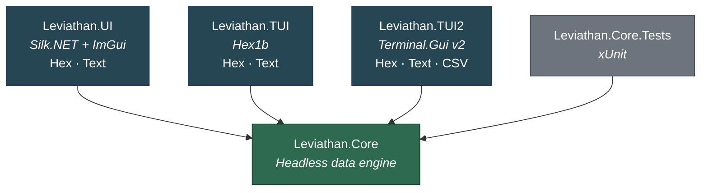
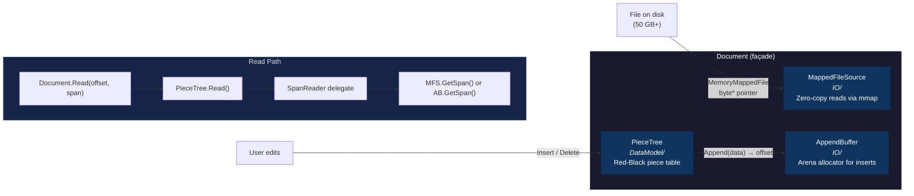
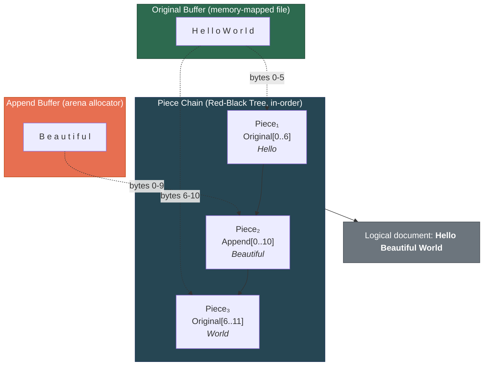
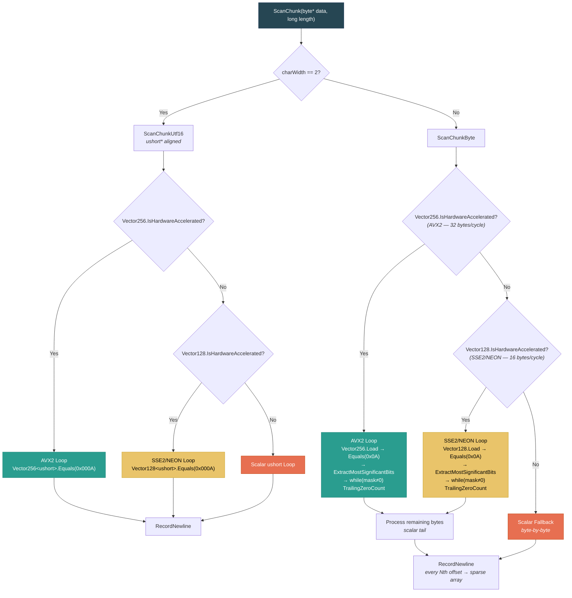
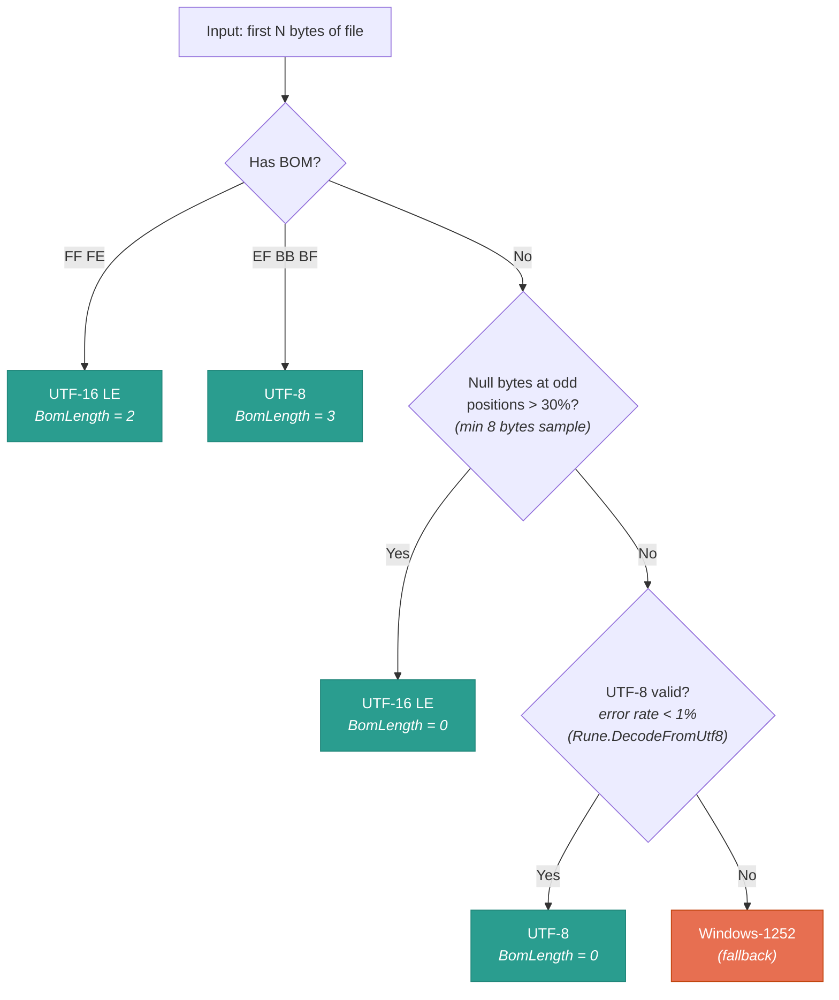
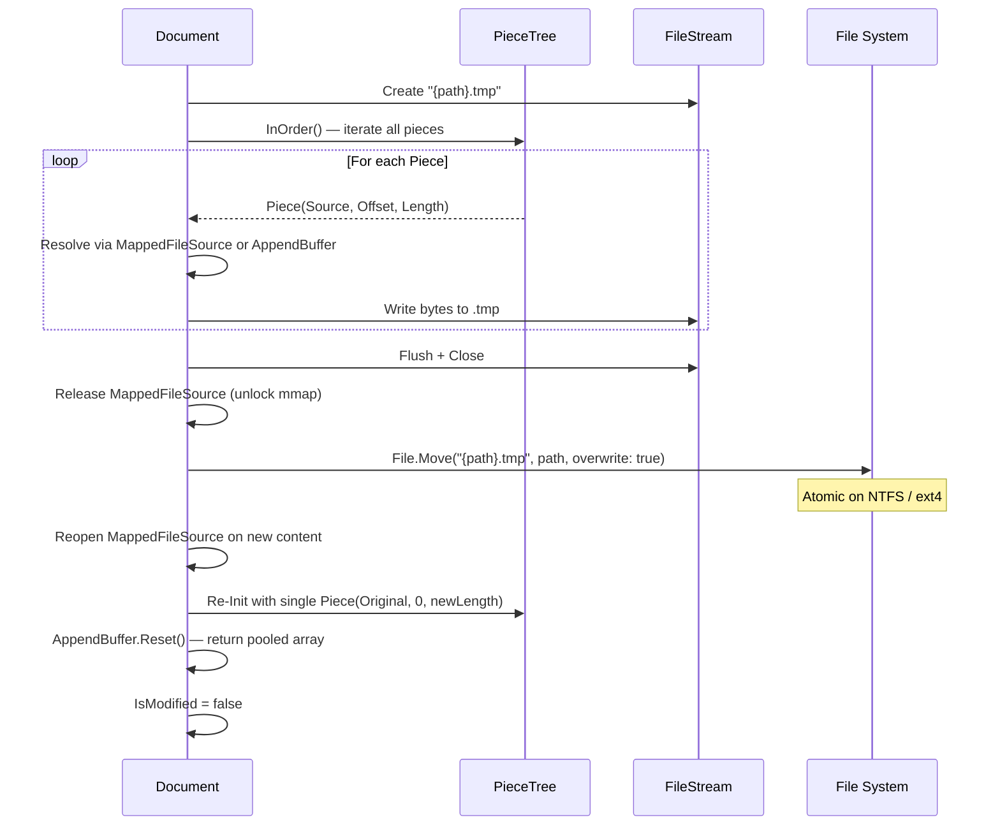

# Leviathan — Architecture Deep-Dive

> **Native AOT · Zero-allocation render loop · < 500 ms open time · 50 GB+ files**

Leviathan is a hex + text editor built in C# / .NET 10, designed to open multi-gigabyte files instantly and edit them without garbage-collection pauses. Every subsystem — from memory-mapped I/O to SIMD line scanning — is engineered around two hard constraints: **sub-500 ms open time** and **zero GC allocations on the hot path**.

This document is a comprehensive technical reference for contributors and curious developers.

---

## Table of Contents

- [System Overview](#system-overview)
- [Data Pipeline](#data-pipeline)
- [PieceTree — Red-Black Piece Table](#piecetree--red-black-piece-table)
- [SIMD Line Indexing](#simd-line-indexing)
- [Search Engine](#search-engine)
- [Text Encoding & Decoding](#text-encoding--decoding)
- [Line Wrap Engine](#line-wrap-engine)
- [CSV Engine](#csv-engine)
- [Atomic Save](#atomic-save)
- [Design Principles](#design-principles)

---

## System Overview

The solution is split into four projects with a strict dependency rule: **Core knows nothing about UI**.

| Project | Role | AOT | Framework |
|---|---|---|---|
| `Leviathan.Core` | Headless data engine — zero UI dependencies, zero NuGet dependencies | `IsAotCompatible` | — |
| `Leviathan.UI` | Desktop GUI — OpenGL 3.3 + Dear ImGui | Trim-analyzed | Silk.NET + Hexa.NET.ImGui |
| `Leviathan.TUI` | Terminal UI — raw ANSI escape codes | `PublishAot` | Hex1b |
| `Leviathan.TUI2` | Terminal UI — rich widget toolkit | `PublishAot` | Terminal.Gui v2 |

All three frontends reference `Leviathan.Core` and compose the same `Document` / `LineIndexer` / `SearchEngine` / `ITextDecoder` APIs. Each has its own composition root (`Program.cs` with top-level statements), settings persistence (`*-settings.json` with source-generated `JsonSerializerContext`), and view implementations.



### Core File Layout

```
Leviathan.Core/
├── Document.cs              # Public façade (190 lines)
├── IO/
│   ├── MappedFileSource.cs  # Memory-mapped zero-copy reads (97 lines)
│   └── AppendBuffer.cs      # Arena allocator for edits (92 lines)
├── DataModel/
│   ├── Piece.cs             # Value-type piece descriptor (16 lines)
│   ├── PieceNode.cs         # RB-tree node with augmented lengths (33 lines)
│   └── PieceTree.cs         # Red-Black piece table (502 lines)
├── Indexing/
│   ├── LineIndexer.cs       # Background line scanner (71 lines)
│   └── LineIndex.cs         # SIMD newline detection + sparse index (266 lines)
├── Search/
│   ├── SearchEngine.cs      # Boyer-Moore-Horspool streaming search (209 lines)
│   └── SearchResult.cs      # Result value type (7 lines)
├── Text/
│   ├── EncodingDetector.cs  # BOM/heuristic detection (147 lines)
│   ├── TextEncoding.cs      # Encoding enum (16 lines)
│   ├── ITextDecoder.cs      # Stateless decoder interface (52 lines)
│   ├── Utf8TextDecoder.cs   # UTF-8 implementation (62 lines)
│   ├── Utf16LeTextDecoder.cs # UTF-16 LE with surrogates (124 lines)
│   ├── Windows1252TextDecoder.cs # Single-byte Western (129 lines)
│   ├── Utf8Utils.cs         # Static UTF-8 helpers + CJK width (118 lines)
│   └── LineWrapEngine.cs    # JIT viewport-only wrapping (141 lines)
└── Csv/
    ├── CsvDialect.cs        # Dialect value type + factories (35 lines)
    ├── CsvDialectDetector.cs # DuckDB-style dialect sniffer (214 lines)
    ├── CsvHeaderDetector.cs  # Header row detection (319 lines)
    ├── CsvFieldParser.cs     # Zero-alloc RFC 4180 parser (187 lines)
    ├── CsvRowIndexer.cs      # Background row scanner (149 lines)
    └── CsvRowIndex.cs        # Quote-aware sparse row index (223 lines)
```

---

## Data Pipeline

`Document` (190 lines) is the **public façade** — the single entry point that all frontends use to open, read, edit, and save files. It composes three lower-level subsystems and hides their interactions behind a clean API.



### `MappedFileSource` (IO/) — 97 lines

Wraps `MemoryMappedFile` to provide **true zero-copy reads** via raw pointer arithmetic.

```csharp
public sealed class MappedFileSource : IDisposable
```

On construction, it creates a read-only memory-mapped file and acquires a raw `byte*` pointer through `SafeMemoryMappedViewHandle.AcquirePointer`. All reads are then simple pointer offsets — no copying, no buffering, no syscalls:

- **`GetSpan(long offset, int length)`** — returns `new ReadOnlySpan<byte>(_pointer + offset, length)`. Marked `[AggressiveInlining]`. Overflow-safe bounds checking via cast to `ulong`.
- **`ReadByte(long offset)`** — direct pointer dereference: `*(_pointer + offset)`. Also `[AggressiveInlining]`.
- Handles **empty files** gracefully: the pointer stays null and no memory-mapped file is created.

The OS virtual memory subsystem manages paging — Leviathan never manually reads chunks of the file. A 50 GB file opens in microseconds because no data is read until the first page fault.

### `AppendBuffer` (IO/) — 92 lines

An **arena allocator** backed by `ArrayPool<byte>.Shared` that absorbs all inserted bytes with zero GC pressure.

```csharp
public sealed class AppendBuffer : IDisposable
```

- Starts with a **4 MB** pooled array (`ArrayPool<byte>.Shared.Rent`).
- **`Append(byte)`** / **`Append(ReadOnlySpan<byte>)`** — writes to the current position and returns the offset for piece-table reference. `[AggressiveInlining]` on the single-byte path.
- **`EnsureCapacity(int)`** — doubles the buffer by renting a new pooled array, copying the existing data, and returning the old array to the pool. No GC allocations.
- **`GetSpan(int offset, int length)`** — read-back for piece resolution. `[AggressiveInlining]`.
- **`Reset()`** — returns the buffer to the pool and rents a fresh one. Called after save to reclaim memory.

The arena model (append-only, reset-all) avoids fragmentation and per-edit allocation overhead.

### `Document` — Tying It Together

```csharp
public sealed class Document : IDisposable
{
    MappedFileSource? _fileSource;
    readonly AppendBuffer _appendBuffer;
    readonly PieceTree _tree;
}
```

- **`Document(string filePath)`** — opens an existing file: creates a `MappedFileSource`, initializes the `PieceTree` with a single `Piece(Original, 0, fileLength)`.
- **`Document()`** — creates an empty document with no file backing.
- **`Read(long offset, Span<byte> buffer)`** — delegates to `PieceTree.Read()`, passing a `SpanReader` delegate that resolves `PieceSource.Original` → `_fileSource.GetSpan()` and `PieceSource.Append` → `_appendBuffer.GetSpan()`.
- **`Insert(long offset, ReadOnlySpan<byte> data)`** — appends the new bytes to `AppendBuffer`, gets the offset, creates a `Piece(Append, offset, data.Length)`, and inserts it into the `PieceTree`.
- **`Delete(long offset, long length)`** — delegates directly to `PieceTree.Delete()`.
- **`SaveTo(string path)`** — [atomic save](#atomic-save).

The `SpanReader` delegate is the critical decoupling mechanism: the `PieceTree` knows nothing about where bytes live — it just calls a delegate with `(PieceSource, offset, length)` and gets a `ReadOnlySpan<byte>` back.

---

## PieceTree — Red-Black Piece Table

The `PieceTree` (502 lines) is the core data structure — a Red-Black tree of `Piece` descriptors that enables O(log N) positional lookup, insert, and delete over arbitrarily large documents.

### Value Types

```csharp
public enum PieceSource : byte { Original = 0, Append = 1 }

public readonly record struct Piece(PieceSource Source, long Offset, long Length);
```

`Piece` is a **value type** (12 bytes on the stack) that identifies a contiguous byte range in either the original memory-mapped file or the append buffer. Zero GC pressure — no heap allocation per piece.

### Tree Nodes

```csharp
internal sealed class PieceNode
{
    public Piece Piece;
    public long SubtreeLength;  // augmented: sum of all piece lengths in subtree
    public PieceNode? Left, Right, Parent;
    public bool IsRed;

    public void UpdateSubtreeLength()
        => SubtreeLength = Piece.Length
            + (Left?.SubtreeLength ?? 0)
            + (Right?.SubtreeLength ?? 0);
}
```

`SubtreeLength` is the **augmentation** that makes positional lookup O(log N) — by comparing the target offset against the left subtree's length, the tree navigates directly to the correct piece without scanning.

### Piece Table Concepts



### Key Operations

**`FindByOffset(long logicalOffset)`** — O(log N) positional lookup:

Starting at the root, the algorithm compares the target offset against the left subtree's `SubtreeLength`. If the offset falls within the left subtree, recurse left. If it falls within the current node's piece, return the node and the local offset within the piece. Otherwise, subtract the left subtree length and the current piece length, and recurse right. This is the classic augmented BST search.

**`Insert(long logicalOffset, Piece newPiece)`** — splits and inserts:

1. `FindByOffset` locates the piece containing the target offset.
2. If the insert is at the boundary between two pieces, the new piece is simply linked in.
3. Otherwise, the existing piece is **split**: the original piece is trimmed to `[start..offset)`, a new node for the inserted piece is created, and a **trailing piece** `[offset..end)` is added.
4. `InsertFixup` restores Red-Black invariants (recoloring and rotations).
5. `FixSubtreeLengthsUp` walks to the root, updating every ancestor's `SubtreeLength`.

**`Delete(long logicalOffset, long length)`** — handles four cases in a loop:

| Case | Action |
|---|---|
| **Whole-node removal** | Delete is ≥ entire piece → `RemoveNode` + `DeleteFixup` |
| **Start trim** | Delete starts at piece start → adjust `Piece.Offset` and `Piece.Length` |
| **End trim** | Delete ends at piece end → reduce `Piece.Length` |
| **Mid-split** | Delete is in the middle → split into two pieces, remove the gap |

**`Read(long logicalOffset, Span<byte> destination, SpanReader reader)`** — walks pieces in order, calling the `SpanReader` delegate to resolve each piece into bytes:

```csharp
public delegate ReadOnlySpan<byte> SpanReader(PieceSource source, long offset, int length);
```

The tree doesn't know about files or buffers — the delegate pattern achieves full decoupling (see [Design Principles](#design-principles)).

**`InOrder()`** — stack-based in-order traversal yielding all pieces left-to-right. Used by `SaveTo` to stream the entire document to disk.

### Red-Black Tree Mechanics

The implementation includes the full complement of RB-tree operations:

- **`InsertFixup`** — uncle-recoloring and LL/LR/RR/RL rotations.
- **`DeleteFixup`** — sibling-based rebalancing with four sub-cases per side.
- **`RotateLeft`** / **`RotateRight`** — standard rotations with `SubtreeLength` recalculation.
- **`GetLeftmost`** / **`GetRightmost`** — `[AggressiveInlining]` traversal helpers.
- **`FixSubtreeLengthsUp`** — post-mutation walk to root updating augmented lengths.

---

## SIMD Line Indexing

For a 50 GB file, counting newlines byte-by-byte would take minutes. Leviathan uses a three-tier SIMD cascade to count newlines at near-memory-bandwidth speed, building a sparse index for O(1) scrollbar positioning.

### Architecture

**`LineIndexer`** (71 lines) is the background orchestrator:

```csharp
public sealed class LineIndexer : IDisposable
```

- On `StartScan()`, fires a `Task.Run` that reads the `MappedFileSource` in **4 MB chunks**.
- Each chunk is `fixed`-pinned to get a `byte*`, then passed to `LineIndex.ScanChunk`.
- Supports cooperative cancellation via `CancellationToken`.
- Parameterized `charWidth`: `1` for UTF-8/Windows-1252, `2` for UTF-16 LE.

**`LineIndex`** (266 lines) is the SIMD-accelerated scanner:

```csharp
public sealed class LineIndex
```

### SIMD Cascade



### AVX2 Inner Loop (UTF-8 path)

The core of the AVX2 path processes **32 bytes per iteration**:

1. **Load**: `Vector256.Load(ptr + i)` — loads 32 bytes from the chunk.
2. **Compare**: `Vector256.Equals(vec, newlineVec)` — produces a 32-byte mask where each matching byte is `0xFF`.
3. **Extract**: `ExtractMostSignificantBits()` — collapses the mask to a 32-bit integer where bit N is set if byte N was `0x0A`.
4. **Walk bits**: `while (mask != 0)` → `BitOperations.TrailingZeroCount(mask)` finds the next set bit → record the newline → clear the bit with `mask &= mask - 1`.

Cancellation is checked every **256 vector iterations** to minimize overhead.

### UTF-16 LE Path

`ScanChunkUtf16` casts the `byte*` to `ushort*` and uses `Vector256<ushort>` / `Vector128<ushort>` comparisons against `0x000A`. Same bitmask extraction and bit-walking pattern, but at 2-byte granularity.

### Sparse Index

Not every newline offset is stored — that would require billions of entries for a 50 GB file. Instead, `LineIndex` stores every **Nth** newline offset (default N = 1000) in a growable `long[]`:

- **`RecordNewline(ref long linesSoFar, long byteOffset)`** — `[AggressiveInlining]`. Increments the line counter; every Nth call stores the offset in the sparse array.
- **`GrowSparseArray(int)`** — doubles the array when full.

This yields O(1) storage growth relative to file size and enables:

- **`EstimateLineForOffset(long byteOffset, long fileLength)`** — binary search on the sparse array to estimate which line a given byte offset falls on. Used for scrollbar positioning over files with trillions of virtual pixels of height.
- **`TotalLineCount`** — read via `Volatile.Read` for thread-safe access from the UI thread while scanning continues in the background.

### Thread Safety

All public counters (`_totalLineCount`, `_sparseEntryCount`, `_isComplete`) use `Volatile.Read` / `Volatile.Write` for lock-free visibility between the background scanner and the UI thread. No mutexes, no `lock` statements.

---

## Search Engine

`SearchEngine` (209 lines) implements streaming **Boyer-Moore-Horspool** search over the `Document`, finding patterns across files of any size without loading the entire file into memory.

```csharp
public static class SearchEngine
```

### Algorithm

BMH uses a **bad-character shift table** (256 entries, one per byte value) to skip ahead when a mismatch occurs. For case-insensitive search, the table stores dual entries for upper and lower ASCII variants.

### Streaming with Chunk Overlap

The search reads the document in **4 MB chunks** via `ArrayPool<byte>.Shared`. The critical detail is **cross-chunk boundary handling**: each chunk carries forward the last `pattern.Length - 1` bytes from the previous chunk, ensuring no matches are missed at boundaries.

```
Chunk N:        [...data... overlap]
Chunk N+1: [overlap ...data... overlap]
```

### Public API

| Method | Description |
|---|---|
| `FindAll(Document, byte[], bool caseSensitive, CancellationToken)` | Streaming `IEnumerable<SearchResult>` — yields matches lazily. Cooperative cancellation. |
| `FindNext(Document, byte[], long startOffset)` | First match at or after `startOffset`. |
| `FindPrevious(Document, byte[], long beforeOffset)` | Last match before `beforeOffset`. |
| `ParseHexPattern(ReadOnlySpan<char>)` | Parses hex strings like `"DE AD BE EF"` into `byte[]`. Uses `stackalloc` for inputs ≤ 512 chars. |

### Zero-Allocation Design

- `SearchResult` is `readonly record struct(long Offset, long Length)` — yielded without heap allocation.
- The chunk buffer is rented once from `ArrayPool<byte>.Shared` and returned after the search completes.
- `ToLowerAscii(byte)` is `[AggressiveInlining]` with a branchless fold.

---

## Text Encoding & Decoding

Leviathan supports three text encodings through a stateless decoder interface, with automatic detection.

### `EncodingDetector` — 147 lines

```csharp
public static class EncodingDetector
{
    public static (TextEncoding Encoding, int BomLength) Detect(ReadOnlySpan<byte> sample);
}
```

Detection follows a **priority chain**:



The UTF-16 LE heuristic works by counting null bytes at odd positions in the sample. In UTF-16 LE text, ASCII characters encode as `[byte, 0x00]`, so a high ratio of nulls at odd indices strongly suggests UTF-16 LE encoding.

### `ITextDecoder` Interface — 52 lines

```csharp
public interface ITextDecoder
{
    TextEncoding Encoding { get; }
    int MinCharBytes { get; }
    (Rune Rune, int ByteLength) DecodeRune(ReadOnlySpan<byte> data, int offset);
    int AlignToCharBoundary(ReadOnlySpan<byte> data, int offset);
    int EncodeRune(Rune rune, Span<byte> output);
    bool IsNewline(ReadOnlySpan<byte> data, int offset, out int newlineByteLength);
    byte[] EncodeString(string text);
}
```

Stateless and safe for the render hot path — no internal buffers, no mutable state.

### Implementations

| Decoder | `MinCharBytes` | Key Details |
|---|---|---|
| `Utf8TextDecoder` (62 lines) | 1 | Thin wrapper over `Utf8Utils`. `DecodeRune` → `Rune.DecodeFromUtf8`. `IsNewline` checks `0x0A` (LF) and `0x0D` (CR). |
| `Utf16LeTextDecoder` (124 lines) | 2 | Full surrogate-pair handling. `AlignToCharBoundary` snaps to even offset, backs up from low surrogate to high surrogate. `EncodeRune` uses `stackalloc char[2]` for `Rune.TryEncodeToUtf16`, then manually writes little-endian bytes. |
| `Windows1252TextDecoder` (129 lines) | 1 | `ReadOnlySpan<char> HighMap` — compile-time inline 32-entry lookup for `0x80–0x9F` → Unicode. `EncodeRune` reverse-maps through the table; unmappable codepoints become `'?'`. |

All interface method implementations are annotated with `[AggressiveInlining]`.

### `Utf8Utils` — 118 lines

Static utilities for zero-allocation UTF-8 processing:

- **`AlignToCharBoundary(ReadOnlySpan<byte>, int offset)`** — walks back ≤ 3 bytes looking for a non-continuation byte (`10xxxxxx` pattern). Essential for safe random-access into UTF-8 streams.
- **`DecodeRune(ReadOnlySpan<byte>, int offset)`** — delegates to `Rune.DecodeFromUtf8`, returns `(Rune, int bytesConsumed)`.
- **`MeasureColumns(ReadOnlySpan<byte>, int tabWidth)`** — iterates runes, sums display widths.
- **`RuneColumnWidth(Rune, int tabWidth)`** — `[AggressiveInlining]`. Tab = tabWidth columns, control = 1, CJK wide characters = 2, everything else = 1.
- **`IsWideCharacter(int codePoint)`** — `[AggressiveInlining]`. Covers Hangul Jamo, CJK Unified Ideographs, Hiragana, Katakana, Fullwidth Forms, and CJK Extensions B–F (`0x1100–0x2FA1F`).

---

## Line Wrap Engine

`LineWrapEngine` (141 lines) computes **JIT viewport-only wrapping** — it only processes the bytes currently visible on screen, not the entire file.

```csharp
public sealed class LineWrapEngine
```

### `VisualLine` — Zero-GC Value Type

```csharp
public readonly struct VisualLine
{
    public readonly long DocOffset;    // byte offset in the document
    public readonly int ByteLength;    // bytes consumed by this visual line
    public readonly int ColumnCount;   // display columns occupied
}
```

A `readonly struct` — allocated on the stack or in caller-provided `Span<VisualLine>` buffers. No heap allocation.

### Core Method

```csharp
public int ComputeVisualLines(
    ReadOnlySpan<byte> data,
    long baseDocOffset,
    int maxColumns,
    bool wrap,
    Span<VisualLine> output,
    ITextDecoder decoder)
```

The caller provides the raw byte span, column limit, wrap mode, and a `Span<VisualLine>` output buffer (typically `stackalloc`). The engine iterates bytes using the `ITextDecoder` for rune decoding and newline detection:

- **Hard line breaks** (LF, CR, CR+LF) always start a new visual line.
- **Soft wraps** occur when `wrap == true` and the column count exceeds `maxColumns`.
- The returned `int` is the number of visual lines written to the output span.

### `FindLineStart` — Backward Line Search

```csharp
public static long FindLineStart(long offset, long docLength, Func<long, Span<byte>, int> readFunc, ITextDecoder decoder)
```

Scans backward in **4096-byte chunks** (using `stackalloc byte[4096]`) to find the start of the line containing `offset`. Used when scrolling up or navigating to an arbitrary offset.

---

## CSV Engine

The CSV subsystem in `Csv/` provides a full-featured, zero-allocation CSV processing pipeline. It mirrors the architecture of the line-indexing system but adds quote-aware state machine logic.

### `CsvDialect` — 35 lines

```csharp
public readonly record struct CsvDialect(byte Separator, byte Quote, byte Escape, bool HasHeader)
```

Value type with factory methods:

| Factory | Separator | Quote | Escape |
|---|---|---|---|
| `CsvDialect.Csv()` | `,` | `"` | `"` |
| `CsvDialect.Tsv()` | `\t` | `"` | `"` |
| `CsvDialect.Semicolon()` | `;` | `"` | `"` |
| `CsvDialect.Pipe()` | `\|` | `"` | `"` |

### `CsvDialectDetector` — 214 lines

A **DuckDB-inspired** dialect sniffer that tries all `delimiter × quote` combinations and picks the highest score.

- Candidates: delimiters = `{, \t | ;}`, quotes = `{" '}`
- `ScoreDialect` parses up to 200 sample rows, counts fields per row using `stackalloc int[200]`, computes a score based on: `consistency_ratio × 1000 + modalFieldCount × 10 + rowCount`.
- `CountFieldsInRow` implements an RFC 4180 state machine. `[AggressiveInlining]`.
- `FindMode` sorts the field-count array (`stackalloc`-based) to find the statistical mode.

### `CsvHeaderDetector` — 319 lines

DuckDB-inspired: if the first row is all-text and subsequent data rows contain numeric/date/boolean columns, the first row is a header.

- Classifies fields into `FieldType : byte { Empty, Text, Number, Boolean, Date }`.
- Uses `stackalloc byte[1024]` for field unescaping.
- `IsDateLike` recognizes common date patterns heuristically.

### `CsvFieldParser` — 187 lines

```csharp
public readonly record struct CsvField(int Offset, int Length, bool IsQuoted)

public static class CsvFieldParser
{
    public static int ParseRecord(ReadOnlySpan<byte> record, CsvDialect dialect, Span<CsvField> fields);
    public static int UnescapeField(ReadOnlySpan<byte> record, CsvField field, CsvDialect dialect, Span<byte> destination);
}
```

Parses one record into a caller-provided `Span<CsvField>` — zero heap allocation. Handles RFC 4180 doubled quotes and backslash escaping. `ParseRecord` is `[AggressiveInlining]`.

### `CsvRowIndex` & `CsvRowIndexer` — Background Scanning

`CsvRowIndexer` (149 lines) mirrors `LineIndexer` but for CSV rows:

- **First chunk is scanned synchronously** for instant first draw; the remainder runs on `Task.Run`.
- `DetectColumnCount` parses the first row using `stackalloc CsvField[256]`.

`CsvRowIndex` (223 lines) is the sparse row-offset index with a **quote-aware state machine**:

- `ScanState : byte { Normal, InQuotedField }` — state carried across chunk boundaries via the `_state` field.
- In `Normal` state, `0x0A` / `0x0D` are row boundaries.
- In `InQuotedField` state, newlines are ignored (they're inside a quoted field).
- Doubled quotes (`""`) return to `InQuotedField`; a quote followed by a non-quote exits to `Normal`.
- Stores every Nth row offset in a sparse `long[]`, with `EstimateRowForOffset` for binary-search scrollbar positioning.

Thread safety follows the same `Volatile.Read` / `Volatile.Write` pattern as `LineIndex`.

---

## Atomic Save

`Document.SaveTo(string destinationPath)` implements a crash-safe save that never leaves the file in a corrupt state.



### Steps in Detail

1. **Stream to temp file**: iterates all pieces via `InOrder()`, resolves each to bytes, writes sequentially to `{destinationPath}.tmp`.
2. **Release memory-mapped file lock**: disposes the current `MappedFileSource` so the OS allows the file to be replaced.
3. **Atomic rename**: `File.Move(tmp, destination, overwrite: true)` — on NTFS and ext4, this is an atomic metadata operation. The file is either fully old or fully new; never half-written.
4. **Reopen**: creates a new `MappedFileSource` on the updated file, re-initializes the `PieceTree` with a single piece spanning the new file.
5. **Reset AppendBuffer**: returns the pooled array and rents a fresh one — all edit data is now in the file.
6. **Error recovery**: if any step fails after the mmap was released, the code attempts to re-open the original file. The `.tmp` file is left for manual recovery.

---

## Design Principles

### Value Types Everywhere

`Piece`, `SearchResult`, `VisualLine`, `CsvDialect`, and `CsvField` are all `readonly record struct` or `readonly struct`. They live on the stack or in spans — zero GC pressure, no boxing, no indirection. This is not an optimization afterthought; it's a foundational design choice that eliminates entire categories of GC pauses.

### Zero-Allocation Hot Path

The render loop must never trigger a GC collection. This is enforced through:

- **`stackalloc`** for formatting buffers in render code (`byte[]`, `char[]`, `CsvField[]`, `VisualLine[]`).
- **UTF-8 string literals** (`"text"u8`) for all ImGui labels and menu items — no `string` allocation.
- **`[MethodImpl(MethodImplOptions.AggressiveInlining)]`** on all hot-path methods to eliminate call overhead.
- **`Span<T>` / `ReadOnlySpan<T>`** as the primary data-passing mechanism — no array copies.

### Unsafe Pointer Arithmetic

Performance-critical code uses `unsafe` directly:

- `MappedFileSource` holds a raw `byte*` from `SafeMemoryMappedViewHandle.AcquirePointer` for zero-copy reads.
- `LineIndex.ScanChunkByte` / `ScanChunkUtf16` operate on `byte*` / `ushort*` for SIMD vector loads.
- `LineIndexer` and `CsvRowIndexer` `fixed`-pin spans to pass `byte*` to the scanners.

### ArrayPool for Buffer Management

All large temporary buffers use `ArrayPool<byte>.Shared`:

- `AppendBuffer` — the main edit arena (4 MB initial, doubles as needed).
- `SearchEngine` — the streaming chunk buffer (4 MB, single rent per search).
- Buffers are always returned to the pool in `Dispose()` or `Reset()`.

### Delegate-Based Composition

The `SpanReader` delegate in `PieceTree` is the key decoupling mechanism:

```csharp
public delegate ReadOnlySpan<byte> SpanReader(PieceSource source, long offset, int length);
```

The tree knows nothing about files, memory maps, or append buffers. `Document` injects the resolution logic at call time. This enables testing the tree in isolation and swapping storage backends without touching tree code.

### Lock-Free Thread Safety

Background scanners (`LineIndexer`, `CsvRowIndexer`) communicate with the UI thread through `Volatile.Read` / `Volatile.Write` on shared counters (`_totalLineCount`, `_sparseEntryCount`, `_isComplete`). No mutexes, no `lock` statements, no `Monitor` — just memory ordering guarantees. This is sufficient because:

- There's exactly **one writer** (the background `Task`) and **one reader** (the UI thread).
- The sparse array is grown only by the writer, and new entries are written before the count is published.
- `_isComplete` is a volatile boolean set once at the end of scanning.

### Facade Pattern

`Document` composes `MappedFileSource`, `AppendBuffer`, and `PieceTree` behind a unified API. Consumers never interact with the subsystems directly — they call `Read`, `Insert`, `Delete`, and `SaveTo`.

### Sealed Classes, No Inheritance

Every class in Leviathan is `sealed`. There are no inheritance hierarchies. Polymorphism is achieved through interfaces (`ITextDecoder`) and delegates (`SpanReader`). This enables:

- **Devirtualization** by the JIT — the compiler knows the exact type.
- **Simpler reasoning** — no hidden overrides, no fragile base class problems.

### AOT Compatibility

`Leviathan.Core` is annotated `<IsAotCompatible>true</IsAotCompatible>`. The frontends that publish as Native AOT (`TUI`, `TUI2`) enforce:

- No runtime reflection.
- No `dynamic` or `Activator.CreateInstance`.
- All JSON serialization uses **source-generated** `JsonSerializerContext` (e.g., `SettingsJsonContext`, `TuiSettingsContext`).
- `rd.xml` TrimmerRootDescriptors preserve types from linker trimming where needed.
